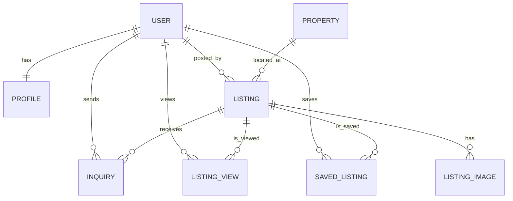

# Milestone 3: Full-Stack Integration

**Gavin Lanno** | March 2026 | GitHub Repository  
**SDLC Phase:** Implementation

---

# 🏘️ Buckeye Sublease

Buckeye Sublease is a two-sided digital marketplace that connects students and landlords seeking to list leases or subleases with individuals searching for short-term or flexible housing.

This milestone focused on building out the **full-stack integration between the React frontend and the ASP.NET backend API.**

---

# 📋 Document Layout

1. Kanban and Prioritization  
2. Systems Architecture Diagram  
3. Database Schema Design  
4. Architecture Decision Records  
5. Component Architecture  
6. AI Tool Usage  

---

# 📅 GitHub Kanban and Prioritization

- Synced issues in the `amis4630` repository to the Kanban project.
- Prioritized items based on the **MVP for persona Ethan Collins**, who is making a sublease listing.

In order for a buyer to pick a listing, listings must exist first, which is why development began with the **seller persona**.

---

# ⚙️ Systems Architecture Diagram

```
Users (Browser)
         |
         | HTTPS
         v
+----------------------------------+
| Frontend (React) — port 5173    |
|  - Vite dev server              |
|  - React components + hooks     |
|  - React Router (client-side)   |
|  - Fetches REST API (JSON)      |
+----------------------------------+
         |
         | HTTPS (JSON) — GET /api/listings
         | CORS header required (cross-origin)
         v
+-----------------------------------+
| Backend API (ASP.NET) — port 7000 |
|  - ListingsController             |
|    GET /api/listings → 200 + JSON |
|    GET /api/listings/{id} → 200   |
|                           or 404  |
|  - Business logic layer           |
|  - Static file serving (wwwroot)  |
+-----------------------------------+
       |                      |
       | SQL connection(TBD)  | Static files
       v                      v
+----------------+  +----------------------+
| Database (SQL) |  | wwwroot/images/      |
| - Users        |  | listings/            |
| - Listings     |  | served at:           |
| - Constraints  |  | /images/listings/    |
+----------------+  +----------------------+
```

**Data Flow**

Frontend ↔ Backend — Request Lifecycle

1. User loads the app → React mounts and App.tsx calls fetch("https://localhost:7000/api/listings")
2. Browser checks CORS — request is cross-origin (port 5173 → 7000), so ASP.NET must respond with the correct Access-Control-Allow-Origin header via the "AllowReact" policy
3. ListingsController receives the request and returns the full listings array as JSON with a 200 OK
4. React stores the response in state and passes the listings array down as props to ListingsPage and ListingDetailPage
5. User clicks a listing card → useNavigate() pushes /listings/{id} to the browser history — no new network request is made
6. ListingDetailPage reads the id via useParams() and finds the matching listing from the already-fetched props array
7. React re-renders the UI with the detail view — all from local state, no second API call needed

---

# 🛠️ How It Works

The frontend includes a **JWT (JSON Web Token)** in the `Authorization` header of API requests.

The JWT contains:

- **Header** — signing algorithm  
- **Payload** — user claims (user ID, role)  
- **Signature** — verifies token authenticity  

The backend validates the token to **authenticate and authorize the user** before executing business logic and querying the database.

---

# 🫙 Database Schema Design

### ERD Relationships


## Database Schema Design

### Entity Relationships

| Entity | Relationship | Entity | Description |
|--------|-------------|--------|-------------|
| USER | has exactly one | PROFILE | Every user has one profile for identity and trust context |
| USER | posts many | LISTING | A user can create multiple sublease listings |
| PROPERTY | has many | LISTING | A building can have multiple units listed simultaneously |
| LISTING | has many | LISTING_IMAGE | Each listing supports a photo gallery |
| USER | saves many | SAVED_LISTING | Buyers can bookmark listings they're interested in |
| USER | views many | LISTING_VIEW | Tracks which listings a user has seen |
| USER | sends many | INQUIRY | Buyers can message sellers about a listing |
| LISTING | receives many | INQUIRY | A listing can receive messages from multiple buyers |

### ERD Diagram



---

# 📚 How ERD Supports User Stories

**Account + Identity**

- A `User` has exactly one `Profile`, enabling user details and trust context.

**Posting Listings**

- A `User` can post many listings, supporting leaseholders creating postings.

**Location Association**

- A `Property` can have many listings, allowing relisting or multiple units at one address.

**Listing Media**

- A listing can have many images, enabling photo galleries.

**Buyer Behavior**

- Users can save listings and view listings via junction tables:
  - `SavedListing`
  - `ListingView`

**Buyer–Seller Communication**

- Users can send inquiries on listings through the `Inquiry` relationship.

---

# 💽 Architecture Decision Records

## 💻 Technology Used

### ADR 1 — Frontend

**Context:** I need a frontend application to build a component based housing marketplace with Typescript, page routing support, and widely used in the industry.

**Options Considered:** Angular is typically used for large-scale enterprices applications, is less flexible, and has a harder learning curve than react.  Vue is more traditional focusing on HTML, and has a smaller and niche community.

**Decision:** React with TypeScript

**Reasoning:** React has highly reuseable UI componenets (listing cards, profiles), is widely used, open-sourced, and backed by Meta. It also has an easy learning curve.

**Consequences:**  React has less built-in features than angular, and the archetecture is less structured which could make it slightly more difficult to manage a larger variety of files.

---

### ADR 2 — Backend

**Context:** I need a backend application that connects to react, is widely used in the industry, can be integrated into azure, can serve REST API endpoints, and can be applied to a varitey of different application types (Websites, business dashboards, complex calculations, etc)

**Options Considered:** Django uses python which is interpreted and dynamically typed, it slows down at a larger scale, and it has a steep learning curve.

**Decision:** ASP.NET with C#

**Reasoning** ASP.Net uses C# which helps catch errors during complie time, its flexible across application types, it has built in database access, maintained by Microsoft, widely used in the industry, and smoothly integrates with Azure.

**Consequences:** ASP.Net has a heavier setup time than other alternatives, however C# reduces runtime errors and the structured project conventions make the codebase easier to navigate as it grows.

---

# 📦 Component Architecture

This section decomposes the property listing UI using **Atomic Design Methodology**.

## Atoms

- Button  
- Input  
- Image  
- Text  
- Icon  

## Molecules

- Search Bar  
- Price display  
- Location display  
- Profile info display  

## Organisms

- Listing component / card  
- Filter sidebar  
- Listing grid  
- Infinite scroll trigger  

## Templates

- Listing catalog grid template  
- Listing catalog map template  

---

# 🤖 AI Tool Usage Milestone 4

**AI Tool Used:** Claude (claude.ai)

This milestone involved AI assistance for scaffolding the backend data layer, models, DTOs, and controllers.

---

# Backend Assistance

### Help Requested

- Difference between a static in-memory store and an EF Core `DbContext`
- Rewriting `ListingStore.cs` into a proper `ListingContext.cs`
- Generating `Listing.cs`, `Category.cs`, `Cart.cs`, `CartItem.cs` models
- Generating `ListingDto.cs`, `CartDto.cs`, `CartItemDto.cs`, `AddToCartDto.cs`, `UpdateCartItemDto.cs`
- Updating `ListingsController.cs` to use DI, async, and DTO mapping
- Verifying `CartController.cs` against project requirements
- Where to register `ListingContext` in `Program.cs`
- Whether migrations apply to an in-memory database

### Prompts Used
```
What is the difference between these two data store files?
Can you rewrite the second data file in the same style as the first?
Can you write the Category.cs file that would work with this DbContext?
Can you create both Cart.cs and CartItem.cs that would work with Listing.cs and Category.cs?
Would this CartController.cs work with the current files you have made?
Where in Program.cs should I insert the DbContext registration?
If I wanted to create a migration what should I put in the terminal?
```

### What Was Accepted

- `ListingContext.cs` with seeded Categories and Listings
- All four model files
- All five DTO files
- Updated `ListingsController.cs` with DI, async, and DTO mapping
- `Program.cs` registration of `ListingContext`

### Personal Judgment

- Kept `Category` as a string on the original `Listing.cs` until confirming a separate `Category.cs` model already existed
- Maintained real estate domain naming (`Listing`, `Address`, `SellerName`) rather than adopting marketplace naming (`Product`, `Name`)
- Reviewed `CartController.cs` independently before submitting rather than having AI write it from scratch

---

# Cart Persistence Test Scenario

- Seed data lives in `ListingContext` and is recreated on every backend restart (in-memory).
- Cart records are created dynamically at runtime for the hardcoded user.
- Test flow:
  1. Start backend and frontend
  2. Add listings to the cart
  3. Refresh the browser — cart reloads from the API
  4. Restart the frontend — cart persists via backend
  5. Restart the backend — cart resets (expected with in-memory DB, resolved in M5 with SQL Server)

---

# Independent Decisions

- Reviewed all AI-generated code before accepting
- Identified and resolved `ListingStore` build error caused by a stale controller file
- Confirmed `DateTime` is valid for `PostedDate` without AI input
- Decided against adding `[Required]` and `[MaxLength]` annotations to keep models consistent

---


# 🤖 AI Tool Usage Milestone 3

**AI Tool Used:** Claude (claude.ai)

This milestone involved AI assistance for scaffolding the full-stack integration.

Below is a summary of what AI helped with, what was modified, and where personal judgment was applied.

---

# Backend Assistance

### Help Requested

- Verification that `ListingsController` met assignment requirements:
  - Two endpoints
  - In-memory data
  - 404 handling
  - CORS
- Static file serving for images stored in `wwwroot`
- Whether `DateTime` is valid for `PostedDate`

### Prompts Used

```
Here are my backend files [ListingStore.cs, Listing.cs, ListingsController.cs, Program.cs] — can you verify these requirements are met?

I'm saving my images in my backend wwwroot folder — does that change how the frontend receives it?

My static data has ImageURL = './wwwroot/images/...' — do I need the entire file path?
```

### What Was Accepted

- Confirmation controller structure was correct
- Explanation of how `wwwroot` is removed from the URL
- Adding `app.UseStaticFiles()` to `Program.cs`

### Personal Judgment

- Maintained **ListingsController naming** instead of ProductsController to match the real estate domain.
- Treated a `Listing` as the real-estate equivalent of a marketplace `Product` for rubric alignment.

---

# Cart Persistence Test Scenario

- Seeded listing data lives in `ListingContext`, and cart records are created dynamically for the hardcoded cart user.
- Test flow:
  1. Start the backend and frontend.
  2. Add one or more listings to the cart.
  3. Refresh the browser and confirm the cart reloads from the API.
  4. Restart the frontend and confirm the cart still loads.
  5. Restart the backend after migrations have been applied and confirm cart rows remain in SQL Server.

---

# Frontend Assistance

### Help Requested

- How to split a monolithic `App.tsx` into reusable components
- Component scaffolding
- React Router setup
- Empty state UI

### Prompts Used

```
Currently I have my App.tsx and App.css with everything in it — how should I break it up to promote reusability?

Let's do it!

Can you verify that all of these requirements are met?

Yes please
```

### What Was Accepted

- `pages/` + `components/` folder structure
- `Listing.ts` type file mirroring the C# model
- React Router setup
- Empty state handling

### Personal Judgment

- Maintained domain-specific component names:
  - `ListingCard`
  - `ListingDetail`
- Kept data fetch in `App.tsx` to avoid redundant network calls.

---

# Independent Decisions

- Renamed marketplace entities to match **Buckeye Sublease domain**
- Reviewed all scaffolded code before accepting
- Corrected image path logic after understanding `UseStaticFiles`
- Verified correct `.NET port` in `launchSettings.json`

---

# 🤖 Previous Milestone AI Usage (ChatGPT)

### Systems Architecture Diagram

Prompt:

```
Can you make a high-level system architecture showing major components
(frontend, backend, database) and how they interact.
```

Follow-up:

```
This is my finished work, what are your thoughts?
```

---

### Entity Relationship Diagram

Prompts:

```
Now I need to make a Database Schema Design using these instructions.
Here is my brainstorm: [relationships list]. Can you double check these entities?
```

```
Can you make an ERD using Mermaid format with the following:
[entities and relationships]
```

```
Do you think my professor will understand that?
I want to be honest and understand it myself.
```

---

# End of Document
