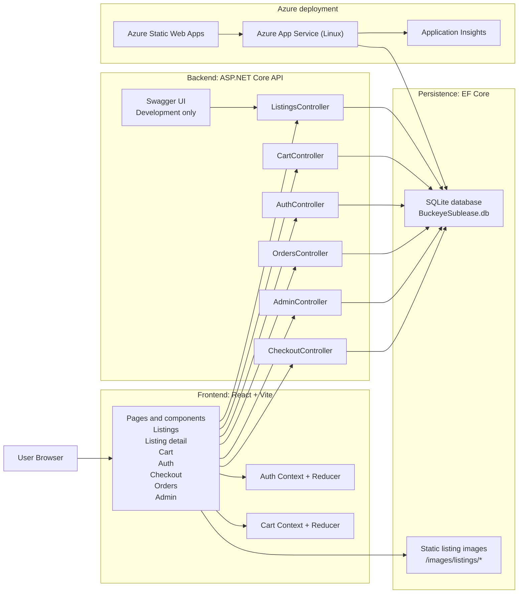

# Buckeye Sublease Architecture

## Overview

Buckeye Sublease is a split frontend/backend system:

- A React + TypeScript SPA served by Vite in local development
- An ASP.NET Core Web API that owns business logic, authentication, persistence, and static listing images
- An EF Core data layer backed by SQLite in development and App Service storage in Azure
- Azure Static Web Apps for the frontend and Azure App Service for the backend in deployed environments

## Current System Diagram

## Request and State Flow

### Listings

1. The SPA loads and fetches `GET /api/listings`.
2. `ListingsController` returns active listings from EF Core.
3. The frontend renders the catalog and routes to listing detail pages with React Router.

### Cart

1. Guests use the `X-Session-Id` header managed by `CartController`.
2. Authenticated users resolve cart ownership from the JWT `NameIdentifier` claim.
3. Cart data persists in the database through `Cart` and `CartItem` entities.

### Authentication

1. Users register through `POST /api/auth/register`.
2. Users log in through `POST /api/auth/token` or `POST /api/auth/login`.
3. The backend signs JWT access tokens with `JWT_SIGNING_KEY` and stores refresh tokens in the database.
4. Authenticated frontend requests include `Authorization: Bearer <token>`.

### Orders and checkout

1. An authenticated user submits checkout data to place an order.
2. `OrdersController` reads the current user's cart, snapshots cart items into `OrderItem` rows, creates an `Order`, then clears the cart.
3. The user can retrieve order history from `GET /api/orders/mine`.

### Admin

1. Admin access is enforced by the `AdminOnly` authorization policy.
2. Admin users can manage listings and update order statuses through protected API endpoints.

## Deployment Shape

- Frontend deployment target: Azure Static Web Apps
- Backend deployment target: Azure App Service for Linux
- Infrastructure source of truth: Bicep templates under [`../infra`](../infra)
- CI/CD entry points: GitHub Actions workflows under [`../.github/workflows`](../.github/workflows)

The deployed frontend calls the deployed API through `VITE_API_URL`, while local development uses the Vite proxy to reach `https://localhost:7000`.
