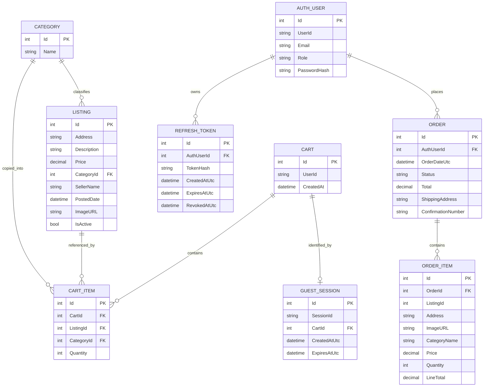

# Buckeye Sublease Database Schema

## Overview

This schema reflects the implemented EF Core model in [`backend/HelloWorldApi/Data/LisitngContext.cs`](../backend/HelloWorldApi/Data/LisitngContext.cs) and the model classes under [`backend/HelloWorldApi/Models/`](../backend/HelloWorldApi/Models). It documents the current database, not the broader milestone-era aspirational ERD.

## Entity Summary

- `Category`: seeded listing categories
- `Listing`: active and soft-deleted property listings
- `Cart`: one persisted cart per guest session or authenticated user
- `CartItem`: listing rows stored in a cart
- `GuestSession`: guest cart identity and expiration
- `AuthUser`: registered users and seeded admin users
- `RefreshToken`: hashed refresh tokens for auth sessions
- `Order`: placed orders for authenticated users
- `OrderItem`: snapshot of purchased listing data at checkout time

## ERD

## Notes

- `Listing.IsActive` implements soft delete for admin listing removal.
- `Cart.UserId` stores either an authenticated user ID or a generated `guest:<sessionId>` identifier.
- `GuestSession` provides 24-hour guest cart continuity through the `X-Session-Id` header.
- `OrderItem` intentionally snapshots listing fields such as address, image URL, category name, and price so historical orders are stable even if a listing changes later.
- `AuthUser.UserId` and `AuthUser.Email` are both unique indexes.
- `RefreshToken.TokenHash` is a unique index, and refresh tokens cascade-delete with their owning `AuthUser`.
